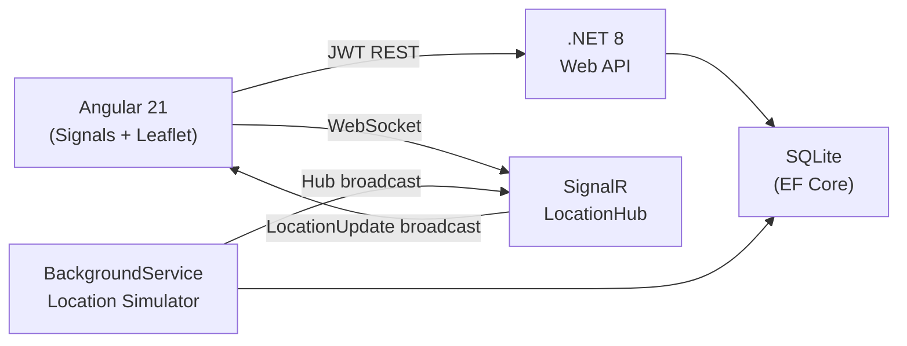

# Trackr — Live Delivery Tracker

[](https://github.com/mittalswati/LiveDeliveryTracker/actions/workflows/ci.yml)


A real-time delivery tracking dashboard built as a portfolio project to explore **Angular 21 signals**, **SignalR WebSockets**, and **Leaflet map rendering** together.

Dispatchers log in and watch 12 live deliveries move across an interactive map, updating every 5 seconds via WebSocket — no page refresh required.

---

## Demo

> **Default credentials**
> Email: `dispatcher@trackr.io` · Password: `Trackr2025!`

<!-- Add a GIF recording here after recording a demo -->

---

## Architecture



---

## Tech Stack

| Layer | Technology |
|---|---|
| Frontend | Angular 21 (standalone, signals, `httpResource`) |
| Map | Leaflet.js — glowing dot markers, CartoDB Positron tiles |
| Real-time | `@microsoft/signalr` WebSocket client + .NET SignalR hub |
| Backend | .NET 8 Web API, Entity Framework Core |
| Database | SQLite (file-based, Docker volume-mounted) |
| Auth | JWT Bearer — `[Authorize]`, `RoleClaimType`, interceptor auto-attach |
| Tests | xUnit + `WebApplicationFactory` integration tests |
| CI | GitHub Actions — build + test on every push |
| Hosting | Azure Static Web Apps (client) + Azure App Service (API) |

---

## Running Locally

### Option A — Two terminals (fastest)

**Prerequisites:** .NET 8 SDK · Node.js 20+ · Angular CLI

```bash
# Terminal 1 — API
cd server/DeliveryTracker.API
dotnet run
# → http://localhost:5001   Swagger: http://localhost:5001/swagger

# Terminal 2 — Angular
cd client
npm install
ng serve
# → http://localhost:4200
```

### Option B — Docker (no prerequisites after install)

```bash
# 1. Copy the env template and fill in a JWT secret
cp .env.docker.example .env.docker
# Edit .env.docker: set Jwt__Secret=<any 32+ char random string>

# 2. Start everything
docker-compose up --build

# App:  http://localhost
# API:  http://localhost:5001
# Swagger: http://localhost:5001/swagger
```

The SQLite database is persisted in the `sqlite-data` Docker volume, so deliveries survive container restarts.

---

## Running Tests

```bash
cd server/DeliveryTracker.Tests
dotnet test --verbosity normal
```

Tests use `WebApplicationFactory<Program>` against a temporary SQLite file. The `LocationSimulatorService` is disabled during tests to prevent DB mutations that could cause assertion flakiness.

**Test coverage:**

| Suite | Tests |
|---|---|
| `AuthControllerTests` | Valid login → 200 + token, wrong password → 401, unknown email → 401, missing fields → 400 |
| `DeliveryControllerTests` | No token → 401, authenticated list → 12 deliveries, by-id happy path, 404, status update |

---

## Project Structure

```
LiveDeliveryTracker/
├── client/                        # Angular 21 frontend
│   ├── src/app/
│   │   ├── core/                  # Services, guards, interceptors, models
│   │   ├── features/              # Dashboard, delivery detail, login
│   │   └── shared/                # Reusable components, pipes, constants
│   ├── Dockerfile
│   └── nginx.conf
├── server/
│   ├── DeliveryTracker.API/       # .NET 8 Web API
│   │   ├── Controllers/
│   │   ├── Hubs/                  # SignalR LocationHub
│   │   ├── Services/              # Auth, Delivery, LocationSimulator
│   │   ├── Data/                  # EF Core DbContext + SeedData
│   │   └── Dockerfile
│   └── DeliveryTracker.Tests/     # xUnit integration tests
├── docker-compose.yml
└── .github/workflows/ci.yml
```

---

## Key Design Decisions

| Decision | Reason |
|---|---|
| **JWT in `localStorage`** | Intentional portfolio tradeoff — documented. Production apps should use `HttpOnly` cookies. |
| **SQLite** | Zero-config persistence. Swap to Postgres by changing one EF Core provider for production scale. |
| **Signal inputs (`input()`) everywhere** | Angular 21 best practice — no `@Input()`/`@Output()` decorators in this codebase. |
| **`httpResource` on detail page** | Replaces `forkJoin` — reactive, built-in loading/error states, `.reload()` after mutations. |
| **`NgZone.runOutsideAngular` for Leaflet** | Prevents Leaflet's frequent DOM events from triggering Angular change detection on every mouse move. |
| **`LocationSimulator` as `BackgroundService`** | Simulates a real GPS feed — no external dependency needed to demo live tracking. |

---

## What I'd Add Next

- **Role-based views** — driver mobile view vs. dispatcher dashboard
- **Delivery history** — chart of daily completed deliveries
- **Push notifications** — browser `Notification API` when a delivery goes `Nearby`
- **Azure deployment** — uncomment the deploy jobs in `ci.yml` and add publish profile secrets
- **Postgres + migrations** — production-ready persistence

---

## License

MIT
